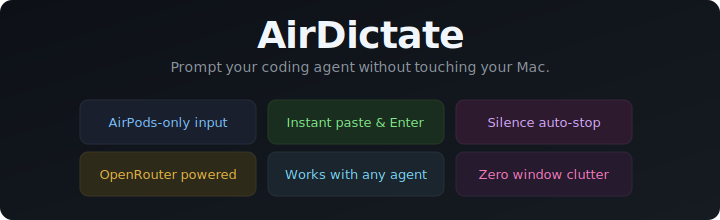

<p align="center">
  
</p>

<p align="center">
  <a href="LICENSE"></a>
  <a href="#requirements"></a>
  
</p>

---

**You're across the room from your Mac. You think of a question for your agent. You press your AirPods, speak, and your prompt lands in Cursor — transcribed, pasted, confirmed. You never touched your keyboard. You never walked to your desk.**

AirDictate is the first tool that lets you prompt coding agents with just your AirPods. No keyboard. No mouse. No walking over. Just press, speak, ship.

---

## Why

Voice tools for agents exist. But they all require you to be at your keyboard — click a button, hold a shortcut, switch windows. AirDictate is the only one that works from your AirPods alone.

| | Other tools | AirDictate |
|---|---|---|
| Trigger | Keyboard shortcut or mouse click | Press AirPods from anywhere |
| Range | At your desk | Across the room |
| Flow | Stop what you're doing, switch windows | Keep doing whatever you're doing |
| Setup | Configure hotkeys, mic sources | Press once, done |

## Install

### Download (recommended)

Grab the latest `AirDictate.app.zip` from [Releases](https://github.com/janek26/AirDictate/releases), unzip, and drag `AirDictate.app` to `/Applications`.

### Via install script

```bash
curl -fsSL https://raw.githubusercontent.com/janek26/AirDictate/main/scripts/install.sh | bash
```

Downloads the latest release and installs to `/Applications` automatically.

### Build from source

```bash
git clone https://github.com/janek26/AirDictate.git
cd AirDictate
swift build -c release
open .build/release/AirDictate.app
```

## Setup

On first launch, AirDictate walks you through each permission before asking for it:

1. **Microphone** — we explain why, you click Allow, the native dialog appears
2. **Accessibility** — we explain why (pasting needs Cmd+V simulation), you open System Settings and toggle AirDictate on
3. **Keychain** — we explain we'll store your API key securely, you confirm
4. **API Key** — paste your [OpenRouter API key](https://openrouter.ai/settings/keys) and pick a model

Done. Press your AirPods and talk to your agent.

You can change anything later in Settings (menu bar → Settings).

## Use

**Press AirPods** → **Speak** → **Silence auto-stops** → **Text pasted + Enter**

That's it. Works in Cursor, Claude Code, Copilot, Windsurf, Cline, Terminal, Slack — anywhere your cursor accepts text.

The menu bar icon shows your state: idle, recording, or transcribing.

## Configuration

| Setting | Default |
|---|---|
| Model | Whisper Large V3 (10+ models via OpenRouter) |
| Silence timeout | 6s |
| Max recording | 300s |
| Press Enter after paste | On |
| Start at Login | Off |

## Requirements

- macOS 14+
- AirPods (any gen) or media-remote headphones
- [OpenRouter](https://openrouter.ai) account (free, pay-per-use)

## Privacy

Audio is recorded locally, transcribed via OpenRouter over HTTPS, then discarded. Your API key lives in the macOS Keychain. No telemetry, no analytics.

## License

MIT
